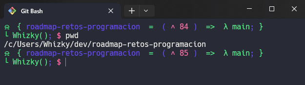

# Tema: bambina
---



Este tema está basado en `Oh My Posh`. El cual, básicamente lo que hace es permitir perzonalizar la terminal con colores y con los fragmentos (path, usuario, git, batería, hora...) que nosotros queramos que se muestren. Oh My Posh ya tiene temas predefinidos los cuales se pueden utilizar con solo instalar Oh My Posh, para ver los temas que hay disponibles, consultar **[aquí](https://ohmyposh.dev/docs/themes)**; o si por el contrario queremos hacer nuestro propio tema perzonalizado a nuestro gusto, podemos hacerlo consultando su documentación **[aquí](https://ohmyposh.dev/docs/configuration/general)**.

- Repo de **[github](https://github.com/JanDeDobbeleer/oh-my-posh) - JanDeDobbeleer**

## Instalación de Oh My Posh

Para realizar la instalación, tengo 2 recomendaciones:

1. Seguir la **[documentación](https://ohmyposh.dev/docs/installation/windows)**.
2. Seguir el siguiente **[tutorial](https://www.youtube.com/watch?v=6SGIFVJ5Izs&list=PLHBG-OwFBJe87f48iv-6-bqE8aKcITSDo&index=5)** del canal de YouTube **HolaMundo**.

### Archivo .bashrc


Por defecto en el archivo `.bashrc` la configuración es:

```
eval "$(oh-my-posh init bash --config ~/AppData/Local/Programs/oh-my-posh/themes/lambda.omp.json)" 
```
Cambiar `lamda.omp.json` por el nombre del tema que guste, por ejemplo `xxx.omp.json`


## Tema personalizado


Luego, en una carpeta distinta llamada `Dev` cree el tema personalizado llamado bambina.json, el cual está inspirado en una **función flecha** de **javascript**; y por último, en el archivo `.bashrc` modifiqué la configuración así:

```
eval "$(oh-my-posh init bash --config ~/Dev/oh-my-posh/bambina.json)" 
```

De esa manera le tema que he creado a mi gusto ya estaría siendo aplicado.

> by marisol henao